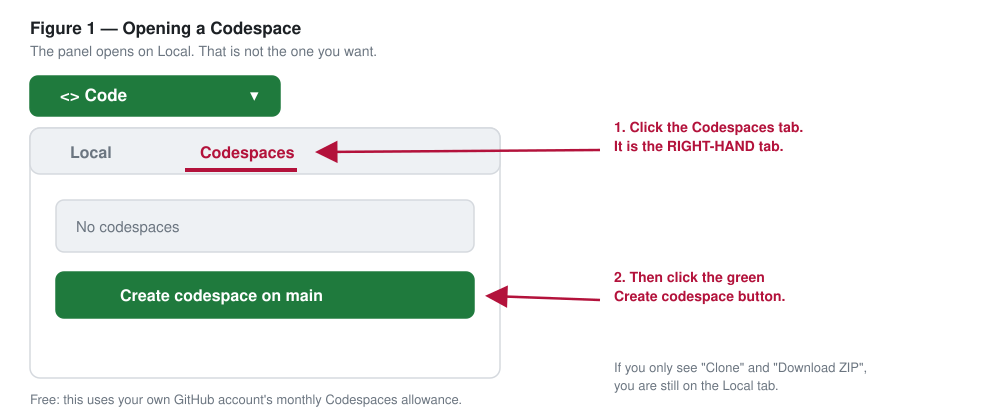
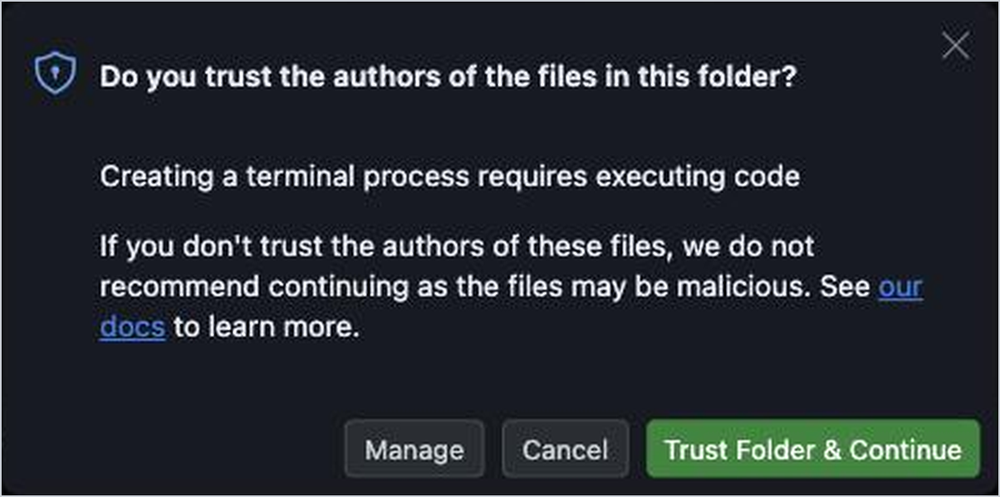
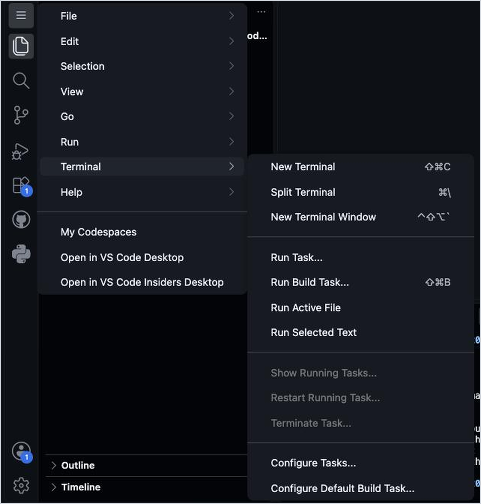

# Agentic Classroom

A starter repository for teaching with, and building, agentic AI. You fork it,
open a GitHub Codespace on your fork, give it your own OpenRouter key, and get a
working AI agent in a browser tab: [OpenClaw](https://www.npmjs.com/package/openclaw)
(a harness that lets a model read files, write files and run commands) connected
to Gemini 3.8 Flash through OpenRouter, with every step it takes shown on screen,
a folder for your own documents, a folder that becomes a public website, short
exercises, and assignment and rubric templates you can adapt. Nothing to install
on your laptop. Built for the ASEE Midwest 2026 workshop *From Chatbots to Agents*.

New to the vocabulary (agent, harness, Codespace)? Read [`PRIMER.md`](PRIMER.md)
first. It takes ten minutes.

**What you need:** a free GitHub account, an OpenRouter account with a few dollars
of credit, and a laptop with a modern browser.

---

## 1. Get an OpenRouter key, with a credit limit

OpenRouter is a switchboard: one account and one key reach models from many
companies, and you pay per use.

1. Create an account at <https://openrouter.ai> and add a small amount of credit.
2. Go to <https://openrouter.ai/settings/keys> and create a key.
   **Give it a credit limit of $5-10.** The limit caps what anything holding the
   key can spend, including the agent itself.
3. Copy the key (it starts with `sk-or-`). You will paste it once, in step 3 or 4.

**What it costs.** Roughly $0.10-0.50 for a typical agent task on Gemini 3.8
Flash (a few minutes of the agent reading files and writing a result). Longer
tasks cost more. Prices change; check your usage at <https://openrouter.ai/activity>.
Avoid models whose names end in `:free`: they are rate-limited for your whole
account and an agent hits the limit quickly.

Treat the key like a password. Never paste it into a chat, an email, a file in
the repository, or a web page.

## 2. Fork this repository

At the top right of this page, click **Fork**, then **Create fork**. You now own
a copy under your own GitHub account. Everything below happens on **your fork**.

## 3. Optional, recommended: store the key as a Codespaces secret

A Codespaces secret means nobody types the key, and every Codespace you create on
your fork gets it automatically.

1. Go to <https://github.com/settings/codespaces> (your profile picture →
   **Settings** → **Codespaces**).
2. Under **Secrets**, click **New secret**.
3. **Name:** `OPENROUTER_API_KEY`. **Value:** your key.
4. **Repository access:** choose your fork (`your-username/agentic-classroom`).
5. Click **Add secret**.

Add the secret **before** you create the Codespace. A Codespace that is already
running does not see a new or changed secret until you stop and restart it.

Optional second secret: `OPENCLAW_MODEL`, to use a different model, written in
full, for example `openrouter/google/gemini-3.8-flash` (the default).

## 4. Create a Codespace

1. On your fork, click the green **Code** button, then the **Codespaces** tab,
   then **Create codespace on main**.

   

2. The first creation on a fork takes **a few minutes**: the container is built
   and the agent installed from scratch. (This repository does not assume a
   *prebuild*; see "For the repository owner" below.) Later restarts are fast.
3. When the terminal first tries to start, a box asks whether you trust the
   authors of the files in this folder. Click **Trust Folder & Continue**.

   

4. **Setup starts by itself** in the terminal at the bottom. Enlarge the panel
   with the square button just left of the **X** at its top right.
   - With a Codespaces secret, it says *Using your Codespaces secret
     OPENROUTER_API_KEY* and carries on.
   - Without one, it asks: *Paste or type your OpenRouter key (it starts with
     sk-or-). It will not show on screen.* Paste it and press Enter. Nothing
     appears as you paste; that is on purpose. It then says how many characters
     it received. You get three tries.
5. It checks the key with OpenRouter (this spends no credit), shows the credit
   left on the key, and warns you if the key has no limit.

If you only see a line ending in `$`, type `bash setup.sh` and press Enter.

## 5. The agent opens: try the exercise

At **READY** the agent opens by itself: a bordered box with a cursor. Type there.
Each step the agent takes shows as an **Exec** card above its reply: the files it
opened and the commands it ran.

Start with [`exercises/hands-on.md`](exercises/hands-on.md): put a few of your own
documents in the `mine/` folder (it is never committed), then type three short
lines, a goal, a check and a rule, and watch where the agent does something other
than what you meant.

**Before you add any document:** what the agent reads is sent to OpenRouter and
the model's provider. Use only material you would be comfortable sending to an
outside company: no student records or student work, no confidential or
unpublished manuscripts, nothing under review, NDA or export control.

All exercises: [`exercises/README.md`](exercises/README.md).

## 6. Build a public website

Anything in the `site/` folder is served as a website while the Codespace runs.

- Ask the agent, for example: `Build site/ teaching beam deflection basics.`
  [`exercises/site-tutor.md`](exercises/site-tutor.md) walks through it.
- **The address** is printed at READY (*Your public site*), and is always in the
  **Ports** tab beside the terminal, on port **8000**.
- **Check it before you share it:** open a second terminal (the **+** on the
  terminal panel) and type `python3 .devcontainer/site-check.py`. It fails on
  key-like strings, broken links and a missing `index.html`, and warns about
  `.edu` email addresses and numbers shaped like student IDs.
- **Everything in `site/` is public on the internet while the Codespace runs.**
  Anyone with the link can open it. It goes offline when the Codespace stops.
  `site/` is never committed; to keep a site, download the folder (right-click it
  in the file list) or publish it somewhere permanent.

## 7. Stop or delete the Codespace when you are done

- A Codespace **stops** by itself after about 30 minutes without activity; you
  can stop it sooner from <https://github.com/codespaces> (the **…** menu →
  **Stop codespace**). A stopped Codespace keeps your files and uses storage
  quota but no compute.
- **Delete** it from the same menu when you no longer need it. Download anything
  you want to keep first. Stopped Codespaces are deleted automatically after a
  retention period (30 days by default).
- **Quota.** Personal GitHub accounts include a monthly free allowance of
  Codespaces compute (counted in core-hours) and storage. This repository asks
  for a 2-core machine, which uses the allowance half as fast as a 4-core one.
  Check the current allowance and your usage at <https://github.com/settings/billing>.
  GitHub Education benefits may raise it for verified teachers and students.

## 8. Using it with students

- **Each student forks** this repository (or your adapted fork of it) and creates
  their own Codespace. Codespace time is billed to each student's own GitHub
  allowance, not to you.
- **Keys, two options.**
  - *Each student uses their own OpenRouter key* with a small credit limit. One
    student's usage cannot exhaust anyone else's.
  - *You issue each student a separate key* with a small limit (for example $2-5),
    created under your account. Never give a class one shared key: one runaway
    agent would spend everyone's budget, and you could not tell who did. If you
    have many students, consider OpenRouter's options for creating keys
    programmatically; check its current documentation.
- Students add their key as a Codespaces secret (step 3) or paste it at the
  prompt. Tell them the rule from step 5 about what documents may be given to
  the agent, and that `site/` is public.
- Templates to adapt: [`exercises/starter-assignment.md`](exercises/starter-assignment.md)
  (delegate, verify, document), [`exercises/starter-build-agent.md`](exercises/starter-build-agent.md)
  (students build a small agent), [`exercises/rubric-template.md`](exercises/rubric-template.md),
  and [`exercises/what-went-wrong.md`](exercises/what-went-wrong.md), a candid list
  from the course this came from.
- If you change your template after students fork it, their forks do not update
  by themselves. Plan changes before the term, not during it.

**What the agent can reach.** The agent runs as you, inside the Codespace. It
could read the saved key in `~/.openclaw/openclaw.json` or, in a terminal where a
Codespaces secret is set, the environment. It is told never to print either, but
a rule is not a wall. That is why the key needs a credit limit.

## 9. Troubleshooting

| What you see | What to do |
|---|---|
| **"That key was not accepted"** | Copy the key again from <https://openrouter.ai/settings/keys> (the whole thing, starting `sk-or-`), or create a new one. Then `bash setup.sh`. |
| "OpenRouter did not accept the key in your Codespaces secret" | Fix the secret at <https://github.com/settings/codespaces>, then stop and restart the Codespace (<https://github.com/codespaces>, **…** → **Stop codespace**, then open it again). |
| You added the secret but setup still asked for the key | The Codespace was created before the secret existed, or the secret does not give your fork access. Check **Repository access**, then stop and restart the Codespace. Pasting the key at the prompt also works. |
| Only a line ending in `$`; setup never started | Type `bash setup.sh`, press Enter. |
| You want to use a different key | `bash setup.sh --reset-key` forgets the saved key and asks again. (A Codespaces secret always wins: change the secret instead.) |
| A line ending in `$` after the agent was running | The agent closed. Type `openclaw chat`, press Enter. |
| "another OpenClaw process owns gateway-lifecycle" | The agent is already open in another terminal: use the terminal list at the right edge of the panel. Only one agent can run at a time. A second terminal is fine for other commands. |
| "Setup has already started in another terminal" | Switch to the first terminal in the list at the right edge of the panel. |
| `openclaw: command not found` | Type `bash setup.sh`; it reinstalls the agent. |
| The site address does not open | Look in the **Ports** tab for port 8000. If its visibility is **Private**, right-click it → **Port Visibility** → **Public** (your organization may not allow this). If port 8000 is missing, stop and restart the Codespace. Refresh after the agent writes files. |
| `Agent couldn't generate a response`, or errors about credit (HTTP 402) | Check your balance and the key's limit at <https://openrouter.ai/settings/keys>. If there is credit, type the same line again. |
| Errors saying a model was not found | Your `OPENCLAW_MODEL` secret is misspelled. Use the full name, like `openrouter/google/gemini-3.8-flash`, or delete the secret, restart, and run `bash setup.sh`. |
| The terminal shrank when you opened a file | The square button just left of the **X** at the terminal panel's top right. |
| You closed the terminal, or there is none | Click the **+** at the top right of the terminal panel. If the whole panel is gone: the **☰** menu at the top left, then **Terminal** → **New Terminal** (picture below). Then use the row in this table that matches what the new terminal shows. |
| Ctrl+C does not stop the agent | Let it finish. If it is stuck for many minutes, close that terminal (the trash-can icon) and open a new one; then `openclaw chat`. |
| Anything else | Delete the Codespace and create a fresh one. A fresh container is the first diagnostic step. |

Setup writes no key to any log. If configuration fails, the reason is in
`~/.agentic-classroom-config.log`.

---

## For the repository owner

- **Pinned versions.** Every version in `.devcontainer/` is pinned on purpose
  (base image by digest, Node 22.23.2, OpenClaw 2026.9.2, Python packages). Read
  the comment at the top of `devcontainer.json` before changing one.
- **Prebuild.** Forks do not inherit prebuilds, so the people who fork this get
  no benefit from one on this repository. Enable one (repository **Settings** →
  **Codespaces**) only if you run a class from one shared repository.
- **Autostart.** Setup runs by itself in each new terminal until it has succeeded
  once (`.devcontainer/autostart.sh`). To switch it off for a terminal, set
  `CLASSROOM_NO_AUTOSTART=1`.

## License

Not yet chosen. Until a license file is added, ask before reusing these
materials outside your own teaching.
